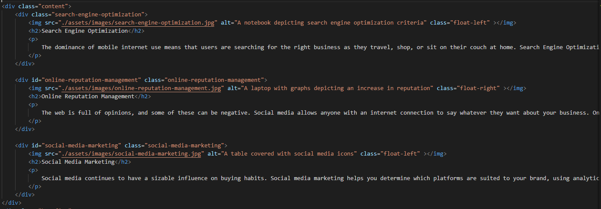

# Refactor HW
This repository is for the code for a HW from a bootcamp that would represent code in the real world. 

The object of the project was to improve acessibility and make the HTML as semantic as possible to better meet SEO criteria.

Over the course of refactoring the codes changes were made that include adding alt attributes to images, reworking H tags, re-writing the self closing img tags to match the non self closing img tags, and some minor spacing of the code for readability. 

## Example snippit of the code after changes and link to the live site
https://thecoaxial.github.io/01-HTML-CSS-Git-Code-Refactor-HW/

